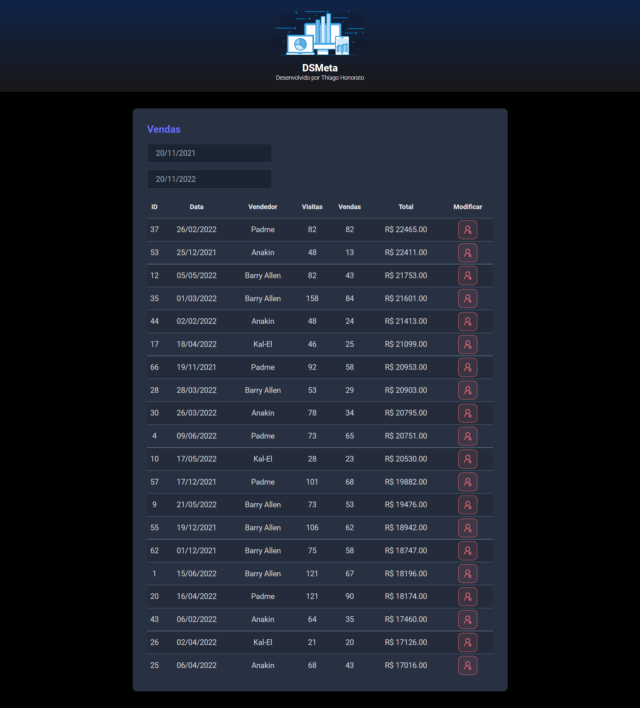

<h1 align="center"> DSMeta </h1>

Projeto desenvolvido na Semana Spring React, evento promovido pelo professor Nélio ALves, responsável pelo DevSuperior.

  <a href="#-tecnologias">Tecnologias</a>&nbsp;&nbsp;&nbsp;|&nbsp;&nbsp;&nbsp;
  <a href="#-projeto">Projeto</a>&nbsp;&nbsp;&nbsp;|&nbsp;&nbsp;&nbsp;
  <a href="#-layout">Layout</a>&nbsp;&nbsp;&nbsp;|&nbsp;&nbsp;&nbsp;
  <a href="#memo-licença">Licença</a>

 

  

## 🚀 Tecnologias

Esse projeto foi desenvolvido com as seguintes tecnologias:

- HTML 
- CSS
- Java
- TypeScript

Frameworks e bibliotecas utilizadas:

- Axios
- Banco de dados H2
- Datepicker
- React
- Spring boot

## 💻 Projeto

O DSMeta é um projeto que apresenta um sistema de vendas, onde é possível fazer a filtragem por data de todas as vendas resgistradas no banco de dados, além do mais é possível enviar um relatório via SMS, usando a ferramenta do Twilio.

## 🔖 Layout

Você pode navegar pelo projeto através [DESSE LINK](https://dsmeta-thiagomonts.netlify.app/).

## :memo: Licença

Esse projeto está sob a licença MIT.

---

Desenvolvido por [Thiago Honorato](https://www.linkedin.com/in/honoratothiago/)